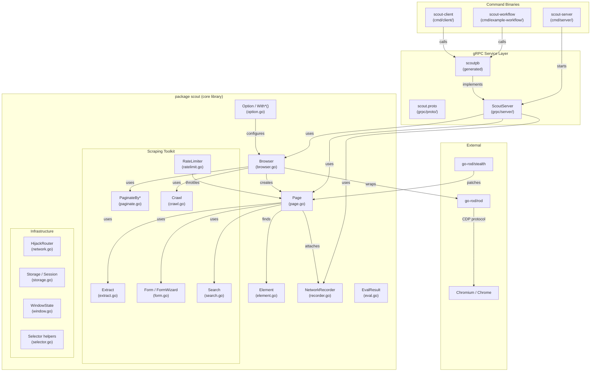
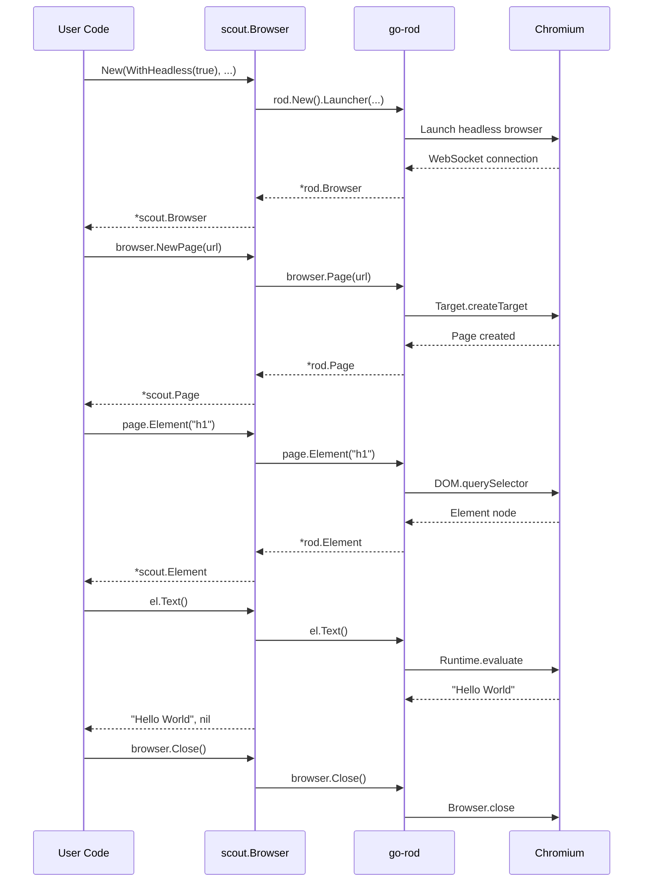
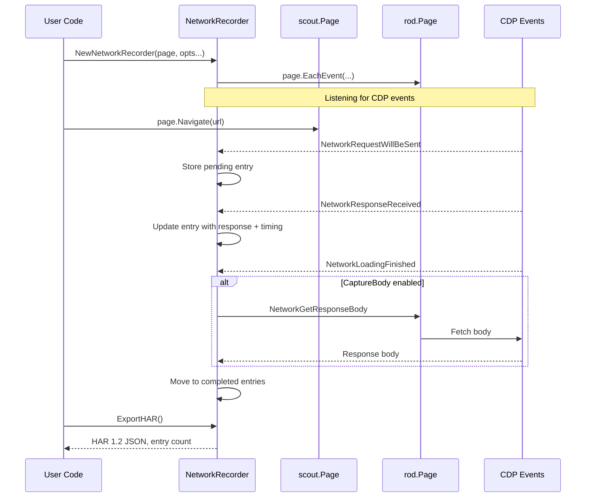
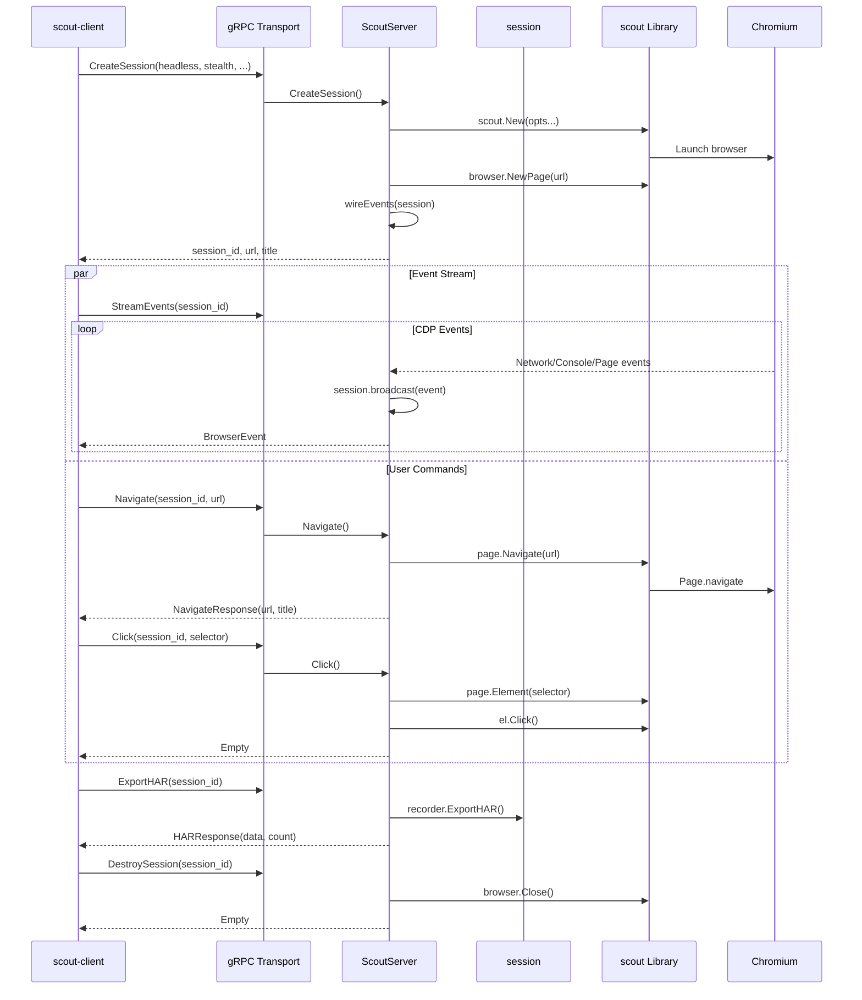
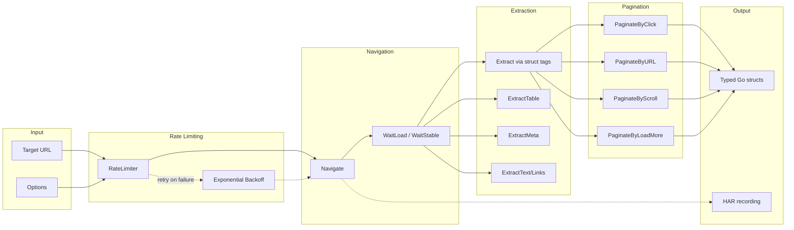

# Architecture

## System Overview

```mermaid
flowchart TB
    subgraph Library["package scout (core library)"]
        Browser["Browser\n(browser.go)"]
        Page["Page\n(page.go)"]
        Element["Element\n(element.go)"]
        Recorder["NetworkRecorder\n(recorder.go)"]
        Options["Option / With*()\n(option.go)"]
        Eval["EvalResult\n(eval.go)"]

        subgraph Scraping["Scraping Toolkit"]
            Extract["Extract\n(extract.go)"]
            Form["Form / FormWizard\n(form.go)"]
            Paginate["PaginateBy*\n(paginate.go)"]
            Search["Search\n(search.go)"]
            Crawl["Crawl\n(crawl.go)"]
            RateLimit["RateLimiter\n(ratelimit.go)"]
        end

        subgraph Infrastructure["Infrastructure"]
            Network["HijackRouter\n(network.go)"]
            Storage["Storage / Session\n(storage.go)"]
            Window["WindowState\n(window.go)"]
            Selector["Selector helpers\n(selector.go)"]
        end
    end

    subgraph gRPC["gRPC Service Layer"]
        Proto["scout.proto\n(grpc/proto/)"]
        PB["scoutpb\n(generated)"]
        Server["ScoutServer\n(grpc/server/)"]
    end

    subgraph Commands["Command Binaries"]
        CmdServer["scout-server\n(cmd/server/)"]
        CmdClient["scout-client\n(cmd/client/)"]
        CmdWorkflow["scout-workflow\n(cmd/example-workflow/)"]
    end

    subgraph External["External"]
        Chrome["Chromium / Chrome"]
        Rod["go-rod/rod"]
        Stealth["go-rod/stealth"]
    end

    Options -->|configures| Browser
    Browser -->|creates| Page
    Page -->|finds| Element
    Page -->|attaches| Recorder
    Page -->|uses| Extract
    Page -->|uses| Form
    Page -->|uses| Search
    Browser -->|uses| Crawl
    Browser -->|uses| Paginate
    RateLimit -->|throttles| Page

    Server -->|uses| Browser
    Server -->|uses| Page
    Server -->|uses| Recorder
    PB -->|implements| Server
    CmdServer -->|starts| Server
    CmdClient -->|calls| PB
    CmdWorkflow -->|calls| PB

    Rod -->|CDP protocol| Chrome
    Stealth -->|patches| Page
    Browser -->|wraps| Rod
```

## Core Library Flow

```mermaid
sequenceDiagram
    participant User as User Code
    participant Scout as scout.Browser
    participant Rod as go-rod
    participant Chrome as Chromium

    User->>Scout: New(WithHeadless(true), ...)
    Scout->>Rod: rod.New().Launcher(...)
    Rod->>Chrome: Launch headless browser
    Chrome-->>Rod: WebSocket connection
    Rod-->>Scout: *rod.Browser
    Scout-->>User: *scout.Browser

    User->>Scout: browser.NewPage(url)
    Scout->>Rod: browser.Page(url)
    Rod->>Chrome: Target.createTarget
    Chrome-->>Rod: Page created
    Rod-->>Scout: *rod.Page
    Scout-->>User: *scout.Page

    User->>Scout: page.Element("h1")
    Scout->>Rod: page.Element("h1")
    Rod->>Chrome: DOM.querySelector
    Chrome-->>Rod: Element node
    Rod-->>Scout: *rod.Element
    Scout-->>User: *scout.Element

    User->>Scout: el.Text()
    Scout->>Rod: el.Text()
    Rod->>Chrome: Runtime.evaluate
    Chrome-->>Rod: "Hello World"
    Scout-->>User: "Hello World", nil

    User->>Scout: browser.Close()
    Scout->>Rod: browser.Close()
    Rod->>Chrome: Browser.close
```

## HAR Network Recording

```mermaid
sequenceDiagram
    participant User as User Code
    participant Rec as NetworkRecorder
    participant Page as scout.Page
    participant Rod as rod.Page
    participant Chrome as CDP Events

    User->>Rec: NewNetworkRecorder(page, opts...)
    Rec->>Rod: page.EachEvent(...)
    Note over Rec,Chrome: Listening for CDP events

    User->>Page: page.Navigate(url)
    Chrome-->>Rec: NetworkRequestWillBeSent
    Rec->>Rec: Store pending entry

    Chrome-->>Rec: NetworkResponseReceived
    Rec->>Rec: Update entry with response + timing

    Chrome-->>Rec: NetworkLoadingFinished
    alt CaptureBody enabled
        Rec->>Rod: NetworkGetResponseBody
        Rod->>Chrome: Fetch body
        Chrome-->>Rec: Response body
    end
    Rec->>Rec: Move to completed entries

    User->>Rec: ExportHAR()
    Rec-->>User: HAR 1.2 JSON, entry count
```

## gRPC Remote Control

```mermaid
sequenceDiagram
    participant Client as scout-client
    participant gRPC as gRPC Transport
    participant Server as ScoutServer
    participant Session as session
    participant Scout as scout Library
    participant Chrome as Chromium

    Client->>gRPC: CreateSession(headless, stealth, ...)
    gRPC->>Server: CreateSession()
    Server->>Scout: scout.New(opts...)
    Scout->>Chrome: Launch browser
    Server->>Scout: browser.NewPage(url)
    Server->>Server: wireEvents(session)
    Server-->>Client: session_id, url, title

    par Event Stream
        Client->>gRPC: StreamEvents(session_id)
        loop CDP Events
            Chrome-->>Server: Network/Console/Page events
            Server->>Server: session.broadcast(event)
            Server-->>Client: BrowserEvent
        end
    and User Commands
        Client->>gRPC: Navigate(session_id, url)
        gRPC->>Server: Navigate()
        Server->>Scout: page.Navigate(url)
        Scout->>Chrome: Page.navigate
        Server-->>Client: NavigateResponse(url, title)

        Client->>gRPC: Click(session_id, selector)
        gRPC->>Server: Click()
        Server->>Scout: page.Element(selector)
        Server->>Scout: el.Click()
        Server-->>Client: Empty
    end

    Client->>gRPC: ExportHAR(session_id)
    Server->>Session: recorder.ExportHAR()
    Server-->>Client: HARResponse(data, count)

    Client->>gRPC: DestroySession(session_id)
    Server->>Scout: browser.Close()
    Server-->>Client: Empty
```

## Bidirectional Interactive Stream

```mermaid
sequenceDiagram
    participant Client as Workflow Client
    participant Stream as Interactive Stream
    participant Server as ScoutServer
    participant Scout as scout Library

    Client->>Stream: Open Interactive()
    Client->>Stream: Command{Navigate, url}
    Stream->>Server: executeCommand()
    Server->>Scout: page.Navigate(url)

    par Events flow back
        Scout-->>Server: CDP events
        Server-->>Stream: BrowserEvent
        Stream-->>Client: BrowserEvent
    end

    Client->>Stream: Command{Type, selector, text}
    Server->>Scout: page.Element(selector).Input(text)

    Client->>Stream: Command{Click, selector}
    Server->>Scout: page.Element(selector).Click()

    alt Command fails
        Server-->>Stream: BrowserEvent{Error}
        Stream-->>Client: ErrorEvent
        Note over Client,Server: Stream continues (not broken)
    end

    Client->>Stream: CloseSend()
    Stream-->>Client: EOF
```

## Scraping Pipeline

```mermaid
flowchart LR
    subgraph Input
        URL[Target URL]
        Config[Options]
    end

    subgraph Rate["Rate Limiting"]
        RL[RateLimiter]
        Backoff[Exponential Backoff]
    end

    subgraph Navigation
        Nav[Navigate]
        Wait[WaitLoad / WaitStable]
    end

    subgraph Extraction
        Extract[Extract via struct tags]
        Table[ExtractTable]
        Meta[ExtractMeta]
        Text[ExtractText/Links]
    end

    subgraph Pagination
        Click[PaginateByClick]
        URLPat[PaginateByURL]
        Scroll[PaginateByScroll]
        LoadMore[PaginateByLoadMore]
    end

    subgraph Output
        Data[Typed Go structs]
        HAR[HAR recording]
    end

    URL --> RL
    Config --> RL
    RL --> Nav
    RL -.->|retry on failure| Backoff
    Backoff -.-> Nav
    Nav --> Wait
    Wait --> Extract
    Wait --> Table
    Wait --> Meta
    Wait --> Text
    Extract --> Click
    Extract --> URLPat
    Extract --> Scroll
    Extract --> LoadMore
    Click --> Data
    URLPat --> Data
    Scroll --> Data
    LoadMore --> Data
    Nav -.-> HAR
```
