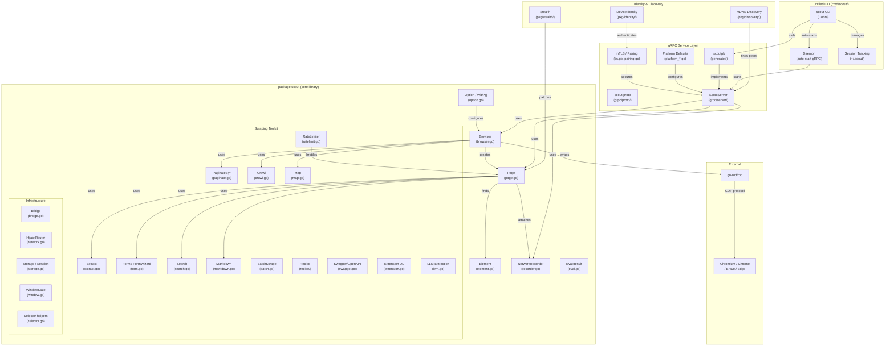
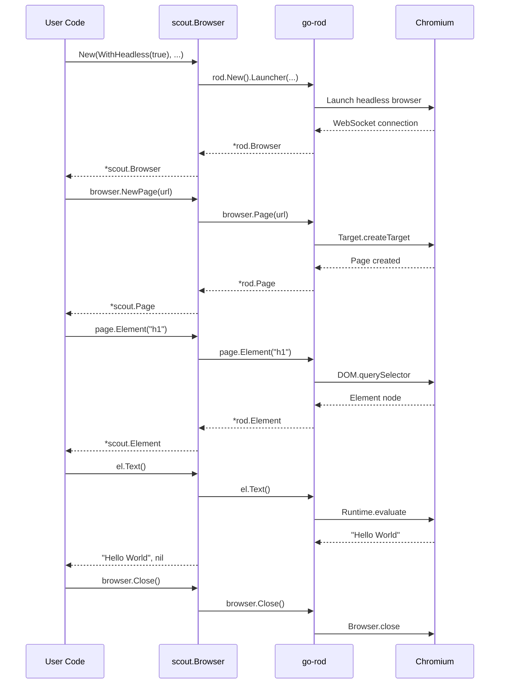
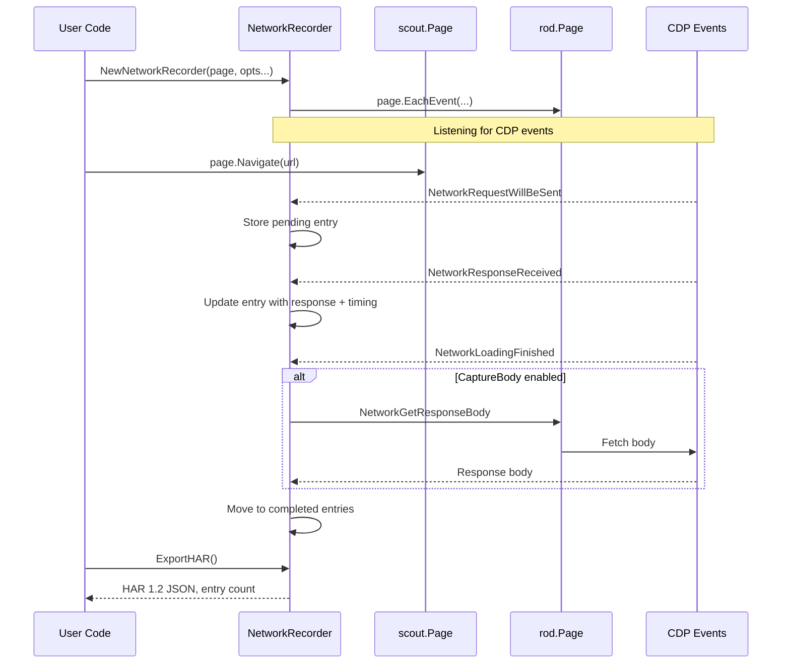
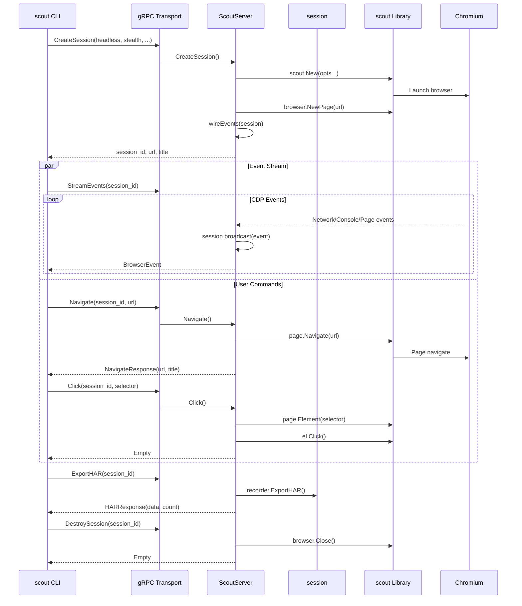
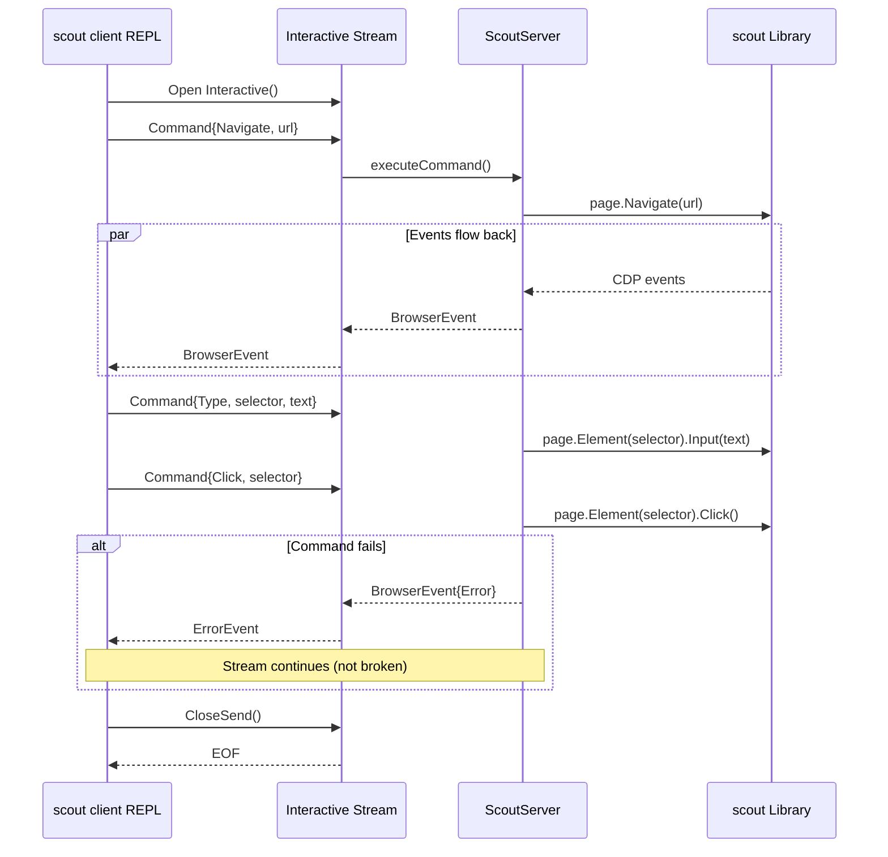
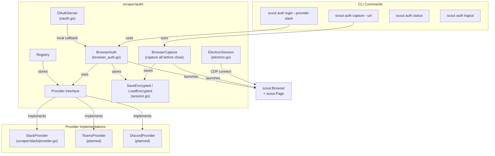
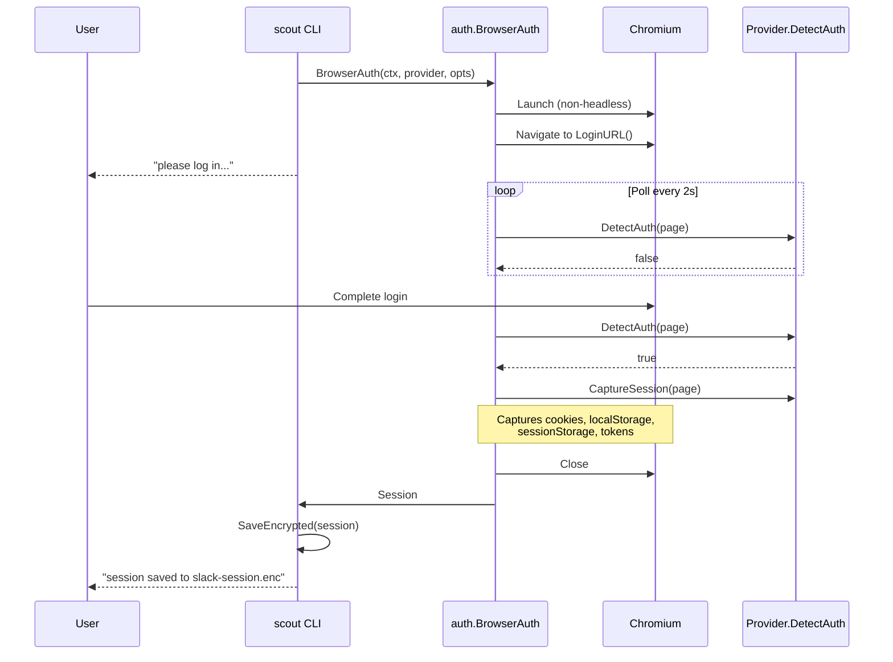
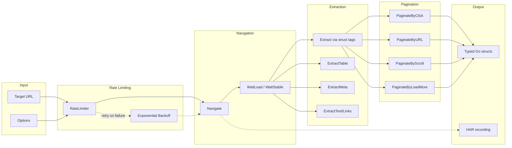

# Architecture

## System Overview

## Core Library Flow

## HAR Network Recording

## gRPC Remote Control

## Bidirectional Interactive Stream

## Generic Auth Framework

## Scraping Pipeline

