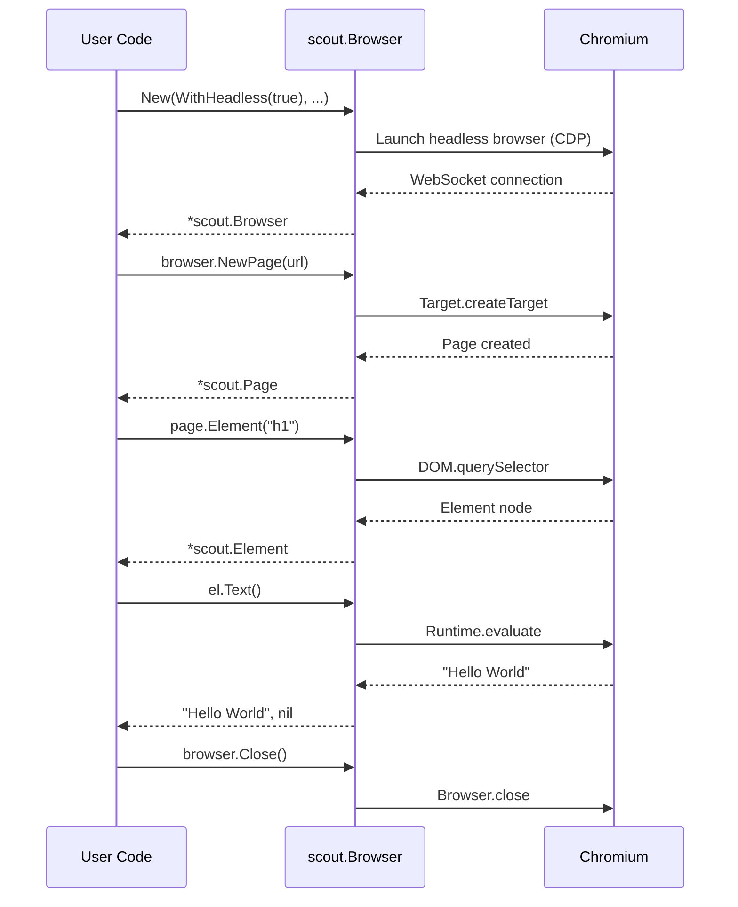
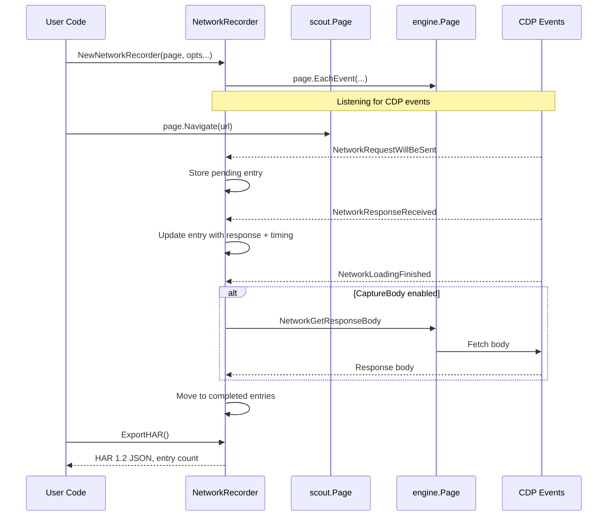
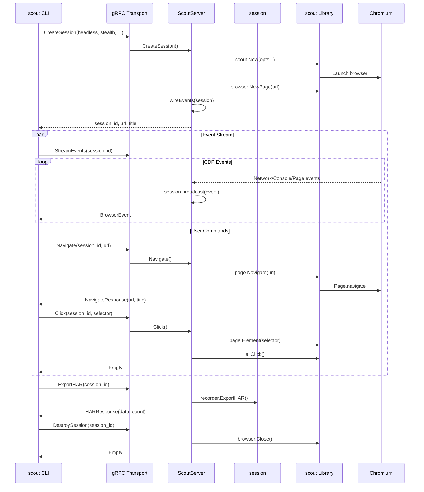
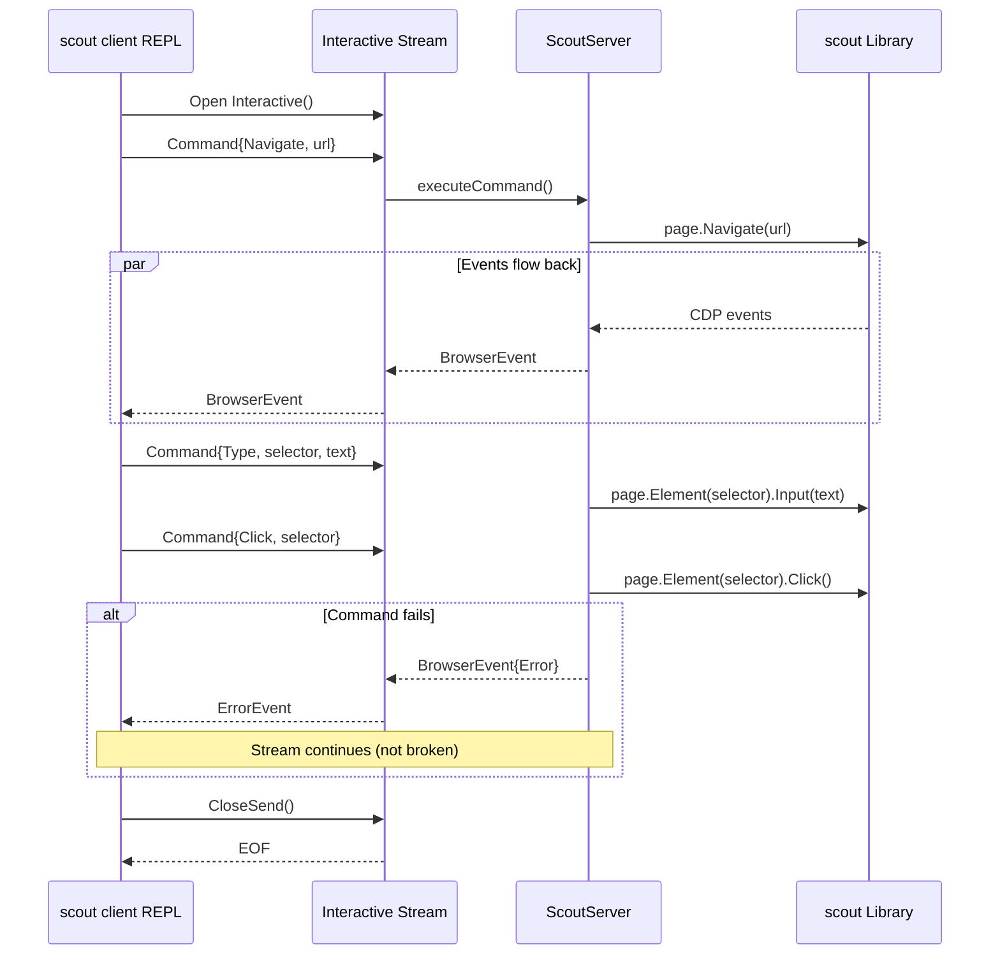
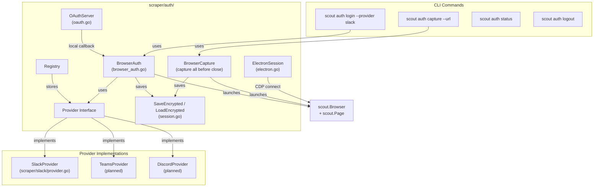
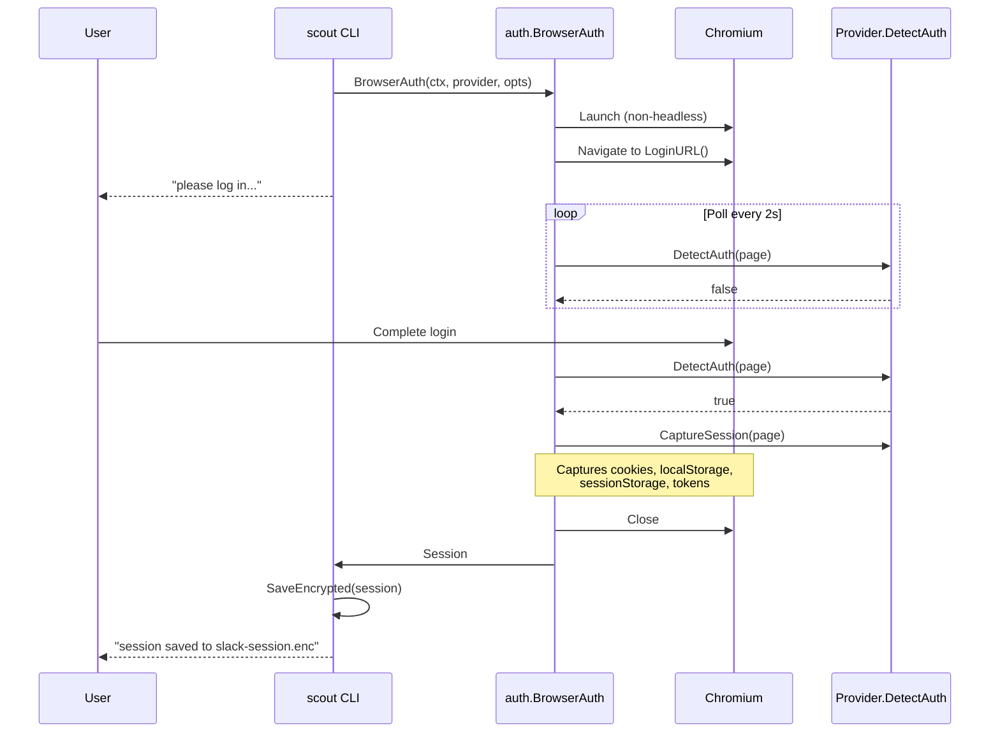
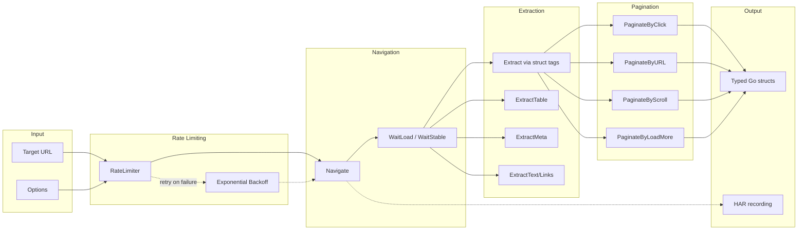

# Architecture

## System Overview

```mermaid
flowchart TB
    subgraph Library["internal/engine (core library)"]
        Browser["Browser\n(browser.go)"]
        Page["Page\n(page.go)"]
        Element["Element\n(element.go)"]
        Recorder["NetworkRecorder\n(recorder.go)"]
        Options["Option / With*()\n(option.go)"]
        Eval["EvalResult\n(eval.go)"]

        subgraph Scraping["Scraping Toolkit"]
            Extract["Extract\n(extract.go)"]
            Form["Form / FormWizard\n(form.go)"]
            Paginate["PaginateBy*\n(paginate.go)"]
            Search["Search\n(search.go)"]
            Crawl["Crawl\n(crawl.go)"]
            Map["Map\n(map.go)"]
            Markdown["Markdown\n(markdown.go)"]
            RateLimit["RateLimiter\n(ratelimit.go)"]
            Batch["BatchScrape\n(batch.go)"]
            Recipe["Recipe\n(recipe/)"]
            Swagger["Swagger/OpenAPI\n(swagger.go)"]
            Extension["Extension DL\n(extension.go)"]
            BrowserDL["Browser Download\n(browser_download.go)"]
            LLM["LLM Extraction\n(llm*.go)"]
            Sitemap["SitemapExtract\n(sitemap.go)"]
            WebFetch["WebFetch\n(webfetch.go)"]
        end

        subgraph Infrastructure["Infrastructure"]
            Bridge["Bridge\n(bridge.go)"]
            Network["HijackRouter\n(network.go)"]
            Storage["Storage / Session\n(storage.go)"]
            Window["WindowState\n(window.go)"]
            Selector["Selector helpers\n(selector.go)"]
        end
    end

    subgraph gRPC["gRPC Service Layer"]
        Proto["scout.proto\n(grpc/proto/)"]
        PB["scoutpb\n(generated)"]
        Server["ScoutServer\n(grpc/server/)"]
        TLS["mTLS / Pairing\n(tls.go, pairing.go)"]
        Platform["Platform Defaults\n(platform_*.go)"]
    end

    subgraph SubPackages["Engine Sub-Packages"]
        Detect["Detect\n(detect/)"]
        Fingerprint["Fingerprint\n(fingerprint/)"]
        Hijack["Hijack\n(hijack/)"]
        LLMPkg["LLM\n(llm/)"]
        VPN["VPN\n(vpn/)"]
        SessionPkg["Session\n(session/)"]
        StealthPkg["Stealth\n(stealth/)"]
    end

    subgraph Identity["Identity & Discovery"]
        DeviceID["DeviceIdentity\n(pkg/scout/identity/)"]
        Discovery["mDNS Discovery\n(pkg/scout/discovery/)"]
        ExtPkg["Extensions\n(extensions/)"]
    end

    subgraph MCP["MCP Server (pkg/scout/mcp/)"]
        MCPServer["MCP Server\n(33 tools, 3 resources)\n11 handler files"]
        MCPTransport["stdio / SSE\n(server.go)"]
    end

    subgraph Commands["Unified CLI (cmd/scout/)"]
        CLI["scout CLI\n(Cobra)"]
        Daemon["Daemon\n(auto-start gRPC)"]
        Sessions["Session Tracking\n(~/.scout/)"]
    end

    subgraph External["External"]
        Chrome["Chromium / Chrome\n/ Brave / Edge"]
    end

    Options -->|configures| Browser
    Browser -->|creates| Page
    Page -->|finds| Element
    Page -->|attaches| Recorder
    Page -->|uses| Extract
    Page -->|uses| Form
    Page -->|uses| Search
    Browser -->|uses| Crawl
    Browser -->|uses| Map
    Page -->|uses| Markdown
    Browser -->|uses| Paginate
    RateLimit -->|throttles| Page

    Server -->|uses| Browser
    Server -->|uses| Page
    Server -->|uses| Recorder
    TLS -->|secures| Server
    Platform -->|configures| Server
    PB -->|implements| Server
    CLI -->|manages| Sessions
    CLI -->|auto-starts| Daemon
    Daemon -->|starts| Server
    CLI -->|calls| PB

    DeviceID -->|authenticates| TLS
    Discovery -->|finds peers| Server
    StealthPkg -->|patches| Page
    ExtPkg -->|embeds| Bridge

    MCPServer -->|uses| Browser
    MCPServer -->|uses| Page
    MCPTransport -->|serves| MCPServer
    CLI -->|starts| MCPServer

    Browser -->|CDP protocol| Chrome
```

## MCP Server Architecture

The MCP server in `pkg/scout/mcp/` was refactored to use a clean handler pattern, extracting tool registrations from a monolithic function into focused, domain-organized files. The `NewServer()` function (~40 lines) acts as a thin orchestrator that calls specialized register functions, each responsible for a cohesive group of related tools.

### Register Pattern

Each handler file implements a `register*Tools(server *mcp.Server, state *mcpState)` function that:
- Takes the MCP server instance and shared state
- Calls `server.AddTool()` for each tool with its schema and handler
- Uses the `mcpState` to access lazy-initialized browser and page instances
- Returns nothing (mutations are direct on the server)

### Handler Files and Tools

| File | Register Function | Tools (Count) |
|------|-------------------|---------------|
| `tools_browser.go` | `registerBrowserTools` | navigate, click, type, extract, eval, back, forward, wait (8) |
| `tools_capture.go` | `registerCaptureTools` | screenshot, snapshot, pdf (3) |
| `tools_search.go` | `registerSearchTools` | search, fetch (2) |
| `tools_session.go` | `registerSessionTools` | session_list, session_reset, open (3) |
| `tools_content.go` | `registerContentTools` | markdown, table, meta (3) |
| `tools_network.go` | `registerNetworkTools` | cookie, header, block (3) |
| `tools_form.go` | `registerFormTools` | form_detect, form_fill, form_submit (3) |
| `tools_analysis.go` | `registerAnalysisTools` | crawl, detect (2) |
| `tools_inspect.go` | `registerInspectTools` | storage, hijack, har, swagger (4) |
| `diag.go` | `registerDiagTools` | ping, curl (2) |
| `resources.go` | `registerResources` | markdown, url, title (3 resources) |

**Total: 33 tools + 3 resources across 11 handler files**

### Organization Principles

- **Browser Navigation & Interaction**: `tools_browser.go` handles page navigation, element manipulation, and basic waits
- **Page Capture**: `tools_capture.go` covers screenshots, snapshots, and PDF export
- **Search & Fetch**: `tools_search.go` provides web search and HTTP fetch capabilities
- **Session Management**: `tools_session.go` tracks browser sessions and state
- **Content Extraction**: `tools_content.go` exports page content as Markdown, tables, or metadata
- **Network Control**: `tools_network.go` manages cookies, headers, and request blocking
- **Form Automation**: `tools_form.go` detects and fills forms, submits them
- **Page Analysis**: `tools_analysis.go` performs crawling and framework detection
- **Inspection Tools**: `tools_inspect.go` provides storage access, HAR export, API inspection, and Swagger schema extraction
- **Diagnostics**: `diag.go` includes connectivity checks (ping) and HTTP debugging (curl)
- **Resources**: `resources.go` registers MCP resources for real-time page content (Markdown, URL, Title)

### State Management

The `mcpState` struct holds:
- `browser`: Lazy-initialized `scout.Browser` instance
- `page`: Current page (created on first tool access)
- `config`: Runtime configuration (headless mode, stealth, binary path)
- `idle`: Optional idle timer for auto-shutdown

Methods:
- `ensureBrowser(ctx)`: Initializes browser if needed
- `ensurePage(ctx)`: Initializes page if needed
- `reset()`: Cleans up browser and page
- `touch()`: Resets idle timer on activity

## Core Library Flow

```mermaid
sequenceDiagram
    participant User as User Code
    participant Scout as scout.Browser
    participant Chrome as Chromium

    User->>Scout: New(WithHeadless(true), ...)
    Scout->>Chrome: Launch headless browser (CDP)
    Chrome-->>Scout: WebSocket connection
    Scout-->>User: *scout.Browser

    User->>Scout: browser.NewPage(url)
    Scout->>Chrome: Target.createTarget
    Chrome-->>Scout: Page created
    Scout-->>User: *scout.Page

    User->>Scout: page.Element("h1")
    Scout->>Chrome: DOM.querySelector
    Chrome-->>Scout: Element node
    Scout-->>User: *scout.Element

    User->>Scout: el.Text()
    Scout->>Chrome: Runtime.evaluate
    Chrome-->>Scout: "Hello World"
    Scout-->>User: "Hello World", nil

    User->>Scout: browser.Close()
    Scout->>Chrome: Browser.close
```

## HAR Network Recording

```mermaid
sequenceDiagram
    participant User as User Code
    participant Rec as NetworkRecorder
    participant Page as scout.Page
    participant Engine as engine.Page
    participant Chrome as CDP Events

    User->>Rec: NewNetworkRecorder(page, opts...)
    Rec->>Engine: page.EachEvent(...)
    Note over Rec,Chrome: Listening for CDP events

    User->>Page: page.Navigate(url)
    Chrome-->>Rec: NetworkRequestWillBeSent
    Rec->>Rec: Store pending entry

    Chrome-->>Rec: NetworkResponseReceived
    Rec->>Rec: Update entry with response + timing

    Chrome-->>Rec: NetworkLoadingFinished
    alt CaptureBody enabled
        Rec->>Engine: NetworkGetResponseBody
        Engine->>Chrome: Fetch body
        Chrome-->>Rec: Response body
    end
    Rec->>Rec: Move to completed entries

    User->>Rec: ExportHAR()
    Rec-->>User: HAR 1.2 JSON, entry count
```

## gRPC Remote Control

```mermaid
sequenceDiagram
    participant Client as scout CLI
    participant gRPC as gRPC Transport
    participant Server as ScoutServer
    participant Session as session
    participant Scout as scout Library
    participant Chrome as Chromium

    Client->>gRPC: CreateSession(headless, stealth, ...)
    gRPC->>Server: CreateSession()
    Server->>Scout: scout.New(opts...)
    Scout->>Chrome: Launch browser
    Server->>Scout: browser.NewPage(url)
    Server->>Server: wireEvents(session)
    Server-->>Client: session_id, url, title

    par Event Stream
        Client->>gRPC: StreamEvents(session_id)
        loop CDP Events
            Chrome-->>Server: Network/Console/Page events
            Server->>Server: session.broadcast(event)
            Server-->>Client: BrowserEvent
        end
    and User Commands
        Client->>gRPC: Navigate(session_id, url)
        gRPC->>Server: Navigate()
        Server->>Scout: page.Navigate(url)
        Scout->>Chrome: Page.navigate
        Server-->>Client: NavigateResponse(url, title)

        Client->>gRPC: Click(session_id, selector)
        gRPC->>Server: Click()
        Server->>Scout: page.Element(selector)
        Server->>Scout: el.Click()
        Server-->>Client: Empty
    end

    Client->>gRPC: ExportHAR(session_id)
    Server->>Session: recorder.ExportHAR()
    Server-->>Client: HARResponse(data, count)

    Client->>gRPC: DestroySession(session_id)
    Server->>Scout: browser.Close()
    Server-->>Client: Empty
```

## Bidirectional Interactive Stream

```mermaid
sequenceDiagram
    participant Client as scout client REPL
    participant Stream as Interactive Stream
    participant Server as ScoutServer
    participant Scout as scout Library

    Client->>Stream: Open Interactive()
    Client->>Stream: Command{Navigate, url}
    Stream->>Server: executeCommand()
    Server->>Scout: page.Navigate(url)

    par Events flow back
        Scout-->>Server: CDP events
        Server-->>Stream: BrowserEvent
        Stream-->>Client: BrowserEvent
    end

    Client->>Stream: Command{Type, selector, text}
    Server->>Scout: page.Element(selector).Input(text)

    Client->>Stream: Command{Click, selector}
    Server->>Scout: page.Element(selector).Click()

    alt Command fails
        Server-->>Stream: BrowserEvent{Error}
        Stream-->>Client: ErrorEvent
        Note over Client,Server: Stream continues (not broken)
    end

    Client->>Stream: CloseSend()
    Stream-->>Client: EOF
```

## Generic Auth Framework

```mermaid
flowchart TB
    subgraph AuthFramework["scraper/auth/"]
        Provider["Provider Interface"]
        Registry["Registry"]
        BrowserAuth["BrowserAuth\n(browser_auth.go)"]
        BrowserCapture["BrowserCapture\n(capture all before close)"]
        OAuth["OAuthServer\n(oauth.go)"]
        Electron["ElectronSession\n(electron.go)"]
        SessionPersist["SaveEncrypted / LoadEncrypted\n(session.go)"]
    end

    subgraph Providers["Provider Implementations"]
        SlackProv["SlackProvider\n(scraper/slack/provider.go)"]
        TeamsProv["TeamsProvider\n(planned)"]
        DiscordProv["DiscordProvider\n(planned)"]
    end

    subgraph CLI["CLI Commands"]
        AuthLogin["scout auth login --provider slack"]
        AuthCapture["scout auth capture --url <any>"]
        AuthStatus["scout auth status"]
        AuthLogout["scout auth logout"]
    end

    Provider -->|implements| SlackProv
    Provider -->|implements| TeamsProv
    Provider -->|implements| DiscordProv
    Registry -->|stores| Provider
    BrowserAuth -->|uses| Provider
    BrowserAuth -->|launches| Scout
    BrowserCapture -->|launches| Scout
    OAuth -->|local callback| BrowserAuth
    Electron -->|CDP connect| Scout

    AuthLogin -->|uses| BrowserAuth
    AuthCapture -->|uses| BrowserCapture
    BrowserAuth -->|saves| SessionPersist
    BrowserCapture -->|saves| SessionPersist

    Scout["scout.Browser\n+ scout.Page"]
```

```mermaid
sequenceDiagram
    participant User as User
    participant CLI as scout CLI
    participant Auth as auth.BrowserAuth
    participant Browser as Chromium
    participant Provider as Provider.DetectAuth

    CLI->>Auth: BrowserAuth(ctx, provider, opts)
    Auth->>Browser: Launch (non-headless)
    Auth->>Browser: Navigate to LoginURL()
    CLI-->>User: "please log in..."

    loop Poll every 2s
        Auth->>Provider: DetectAuth(page)
        Provider-->>Auth: false
    end

    User->>Browser: Complete login
    Auth->>Provider: DetectAuth(page)
    Provider-->>Auth: true
    Auth->>Provider: CaptureSession(page)
    Note over Auth,Browser: Captures cookies, localStorage,<br/>sessionStorage, tokens
    Auth->>Browser: Close
    Auth->>CLI: Session
    CLI->>CLI: SaveEncrypted(session)
    CLI-->>User: "session saved to slack-session.enc"
```

## Scraping Pipeline

```mermaid
flowchart LR
    subgraph Input
        URL[Target URL]
        Config[Options]
    end

    subgraph Rate["Rate Limiting"]
        RL[RateLimiter]
        Backoff[Exponential Backoff]
    end

    subgraph Navigation
        Nav[Navigate]
        Wait[WaitLoad / WaitStable]
    end

    subgraph Extraction
        Extract[Extract via struct tags]
        Table[ExtractTable]
        Meta[ExtractMeta]
        Text[ExtractText/Links]
    end

    subgraph Pagination
        Click[PaginateByClick]
        URLPat[PaginateByURL]
        Scroll[PaginateByScroll]
        LoadMore[PaginateByLoadMore]
    end

    subgraph Output
        Data[Typed Go structs]
        HAR[HAR recording]
    end

    URL --> RL
    Config --> RL
    RL --> Nav
    RL -.->|retry on failure| Backoff
    Backoff -.-> Nav
    Nav --> Wait
    Wait --> Extract
    Wait --> Table
    Wait --> Meta
    Wait --> Text
    Extract --> Click
    Extract --> URLPat
    Extract --> Scroll
    Extract --> LoadMore
    Click --> Data
    URLPat --> Data
    Scroll --> Data
    LoadMore --> Data
    Nav -.-> HAR
```
